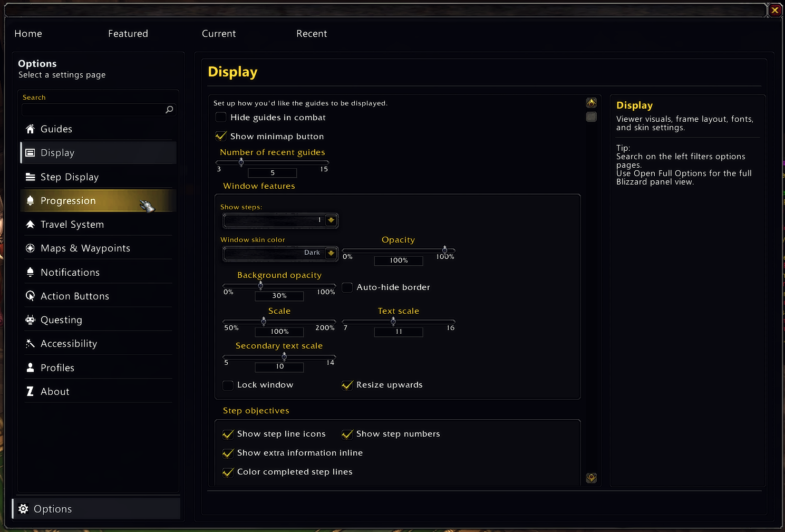
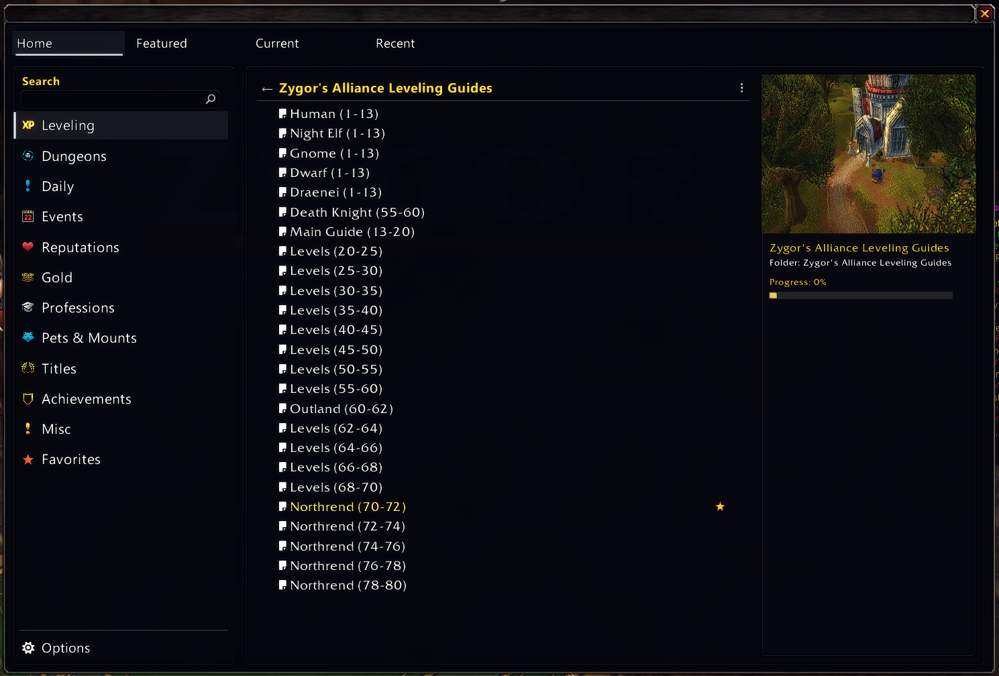
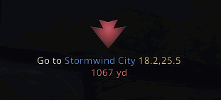
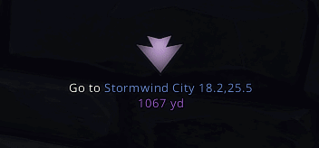
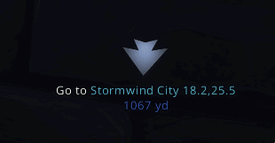
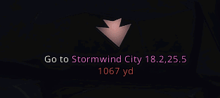

# Zygor Guides Viewer Remaster

Remastered Zygor Guides Viewer for **World of Warcraft: Wrath of the Lich King (WotLK) 3.3.5a (build 12340)**.

A remastered version of the classic Zygor Guides Viewer, updated for WotLK 3.3.5a private servers with a cleaner UI and maintained compatibility.

This project keeps the classic Zygor workflow while delivering a cleaner remastered presentation and active upkeep for the 3.3.5a community.

   

## Version

- Version: 
- Intended client: **WotLK 3.3.5a / 12340**

## Who This Is For

This addon is intended for:

- World of Warcraft **WotLK 3.3.5a (build 12340)** clients
- Private server environments (for example TrinityCore-based servers)
- Players who want the classic Zygor guide experience with a cleaner UI

This project is primarily focused on **WotLK 3.3.5a**. Other clients may work, but support and testing are centered on 3.3.5a.

## What You Get

- Step-by-step leveling and quest progression guidance.
- Arrow and waypoint navigation while you play.
- Structured objective flow (accept, complete, and turn-in).
- A cleaner, more readable viewer UI designed for long play sessions.
- Includes talent guidance via the bundled `ZygorTalentAdvisor` module inside `ZygorGuidesViewerRM`.

## What Stayed the Same

Core 3.3.5a-era behavior is preserved:

- Guide parser and step engine.
- Map and waypoint workflow.
- Legacy guide execution patterns.
- Base `ZygorTalentAdvisor` behavior and structure.

## What's New in the Remaster

- Cleaner, retail-inspired UI shell for both guide browsing and options.
- New standalone Guide Manager (Home / Featured / Current / Recent) with category sidebar, search, favorites, and folder-style tree behavior.
- New in-app Options experience with categorized navigation, searchable pages, and improved layout consistency.
- Remastered waypoint arrow and objective text styling updates, including clearer action/title/distance presentation and distance color gradients.
- Accessibility improvements including colorblind presets and simplified noun-color handling for better readability.
- Ongoing compatibility focus for 3.3.5a environments and expanded guide coverage where applicable.

## Included Components

1. `ZygorGuidesViewerRM` - Remastered viewer and guide runtime.
2. `ZygorTalentAdvisor` - bundled inside `ZygorGuidesViewerRM` and loaded as part of the addon package.

## Key Controls

- Minimap icon:
  - Left-click toggles the guide viewer.
  - Right-click opens the Guide Manager.
  - Shift + Right-click opens options.
- Viewer toolbar:
  - Guides left-click opens the legacy quick guide dropdown.
  - Guides right-click opens the Guide Manager.
  - Settings left-click opens quick settings.
  - Settings right-click opens Guide Manager options.

## Quick Install

### Installation Overview

1. Download the ZIP.
2. Extract to `Interface\AddOns\`.
3. Launch the game.
4. Enable the addon.

### Detailed Steps

1. Close World of Warcraft.
2. Open `%WoWFolder%\Interface\AddOns\`.
3. Remove older folders if present:
   - `ZygorGuidesViewer`
   - `ZygorTalentAdvisor`
   - This avoids mixed files from older releases.
4. Copy this folder into `AddOns`:
   - `ZygorGuidesViewerRM`
5. Confirm the top-level folder exists:
   - `Interface\AddOns\ZygorGuidesViewerRM\ZygorGuidesViewerRM.toc`
6. Launch the game and enable the addon.

## Common Issues

**Addon not showing in-game**

- Make sure the folder structure is:
  - `Interface\AddOns\ZygorGuidesViewerRM\ZygorGuidesViewerRM.toc`
- Do not nest folders (no double folder level).

**Out of date warning**

- Enable **Load out of date AddOns** on the character select screen.

**Guide not progressing**

- Some imported guides may not fully match 3.3.5a data.
- See the Known Issues section below.

## Update Notes

1. Install or update the `ZygorGuidesViewerRM` folder as a single addon package.
2. `/reload` is usually enough for Lua-only changes.
3. A full relaunch is safer when files, XML includes, assets, or bundled modules change.

## Guide Profiles

- Current default guide content is the remastered, TrinityCore-oriented profile for WotLK 3.3.5a private servers.
- An optional Alliance fallback profile exists at `Guides\Leveling_Original\ZygorGuidesAlliance.lua`.
- That fallback is original, unmodified classic Zygor content and should only be used if the remastered default route is problematic for a specific session.

## Localization

Localization key coverage is complete across shipped locales (`Main` + `NPCs`) with placeholder and format-consistency checks.

Current focus is community QA review:

- natural phrasing in live gameplay context,
- terminology consistency,
- official localized NPC proper names,
- encoding and readability verification.

Localization was largely AI-assisted and should be treated as needing community review until native-speaker QA confirms quality.

### Community Credits

- [`mikki33`](https://github.com/mikki33) for providing Russian localization changes and review updates.

## Support Wanted (Localization QA)

If you can validate translations in-game, your help is very welcome.

Please report:

- mistranslations,
- awkward phrasing,
- broken placeholders (`%s`, `%d`, `|n`, color codes),
- incorrect NPC names,
- encoding artifacts.

## Safety and Trust

This addon is fully open source and can be inspected before use.

- 
- You can review all files and changes directly in this repository.
- A VirusTotal scan of the download link is provided for transparency.

## Changelog

### Revision 127 - 3.0.127

- Added a safe isolation pass for the embedded Stat Weights page render failure reported by Russian-locale users.
- Improved the Guide Manager embedded-options fallback panel so it shows a wrapped full error message instead of a truncated line.
- Added targeted debug-only Stat Weights diagnostics that record the last render stage and option key touched before AceConfigDialog fails.
- Hardened the embedded Stat Weights AceConfig callbacks so they always return safe types for name, get, values, and hidden handlers.
- Made dynamic stat-weight input callbacks return empty strings instead of nil where AceConfig expects string values.
- Updated addon version metadata to 3.0.127. 

### Revision 126 - 3.0.126

- Fixed group-loot overlay handling so non-gear loot items no longer receive upgrade, downgrade, or unusable markers.
- Improved BOE upgrade prompting so failed bind/equip confirmation attempts no longer suppress later prompts for the same item.
- Adjusted the group-loot marker presentation to behave more like an icon glow and less like a button overlay.
- Updated addon version metadata to 3.0.126.

### Revision 125 - 3.0.125
- Simplified ItemScore tooltip comparison text so valid items show signed numeric deltas like `+17.3`, `-4.2`, or `0.0` instead of word labels such as upgrade/downgrade/sidegrade.
- Changed invalid ItemScore tooltip output to a short red `Unusable` label.
- Fixed shields being treated as valid upgrades for classes that cannot use them, including quest reward and tooltip recommendation paths.
- Tightened standard armor-family validation so cloth/leather/mail/plate restrictions resolve more reliably before numeric comparison.
- Fixed quest reward selection so unusable rewards can no longer win as upgrades and only remain eligible as vendor-value fallbacks.
- Improved live family resolution for armor/weapon subtype handling, including shield versus generic offhand distinction and cached-item re-evaluation.
- Removed stale cached validity short-circuiting so tooltips and reward logic re-check current validity instead of trusting old cached results.
- Fixed exact equipped tooltip matches to resolve as `0.0`.
- Added targeted tooltip debug output for failing item-family/validity cases when `debug_display` is enabled.
- Fixed a bag-scan crash in `Item-Upgrades.lua` where a missing `UpgradeQueue[slot]` entry could throw `attempt to index local 'upgrade_slot' (a nil value)`.
- Updated addon version metadata to `3.0.125`.

### Revision 124 - 3.0.124

- Fixed the embedded Guide Manager options layout recursion that could overflow the stack with AceGUI-based addons such as xCT+ when opening the Guides/Options tab.
- Fixed Stat Weights rendering and initialization regressions introduced during the itemscore cleanup:
  - normalized pre-10 fake-level handling
  - fixed the parser syntax error in ItemScore
  - fixed stale class/build initialization so low-level characters resolve to their actual class instead of defaulting to Warrior
  - fixed Pawn import/export references still pointing at the old selected spec field
- Added pre-10 class fallback builds using curated leveling baselines, with Stat Weights showing the fallback profile instead of pretending no-talent characters have a real spec.
- Updated the pre-10 fallback mapping to use Wowhead-backed WotLK Classic leveling recommendations as the baseline source.
- Fixed skin and variant switching so the viewer performs a full relayout instead of needing `/reload` to recover text and frame placement.
- Fixed remaster viewer step clipping for longer localized strings by stabilizing width/height measurement and adding a small wrapped-text safety buffer.
- Restored embedded Stat Weights behavior in Guide Manager after the standalone-options detour proved too disruptive.
- Improved ItemScore consistency across tooltip, equip prompt, Gear Finder, and bag scanning:
  - unified more comparisons around weighted deltas
  - fixed stale timer cancellation in GearFinder
  - improved low-level class/build selection and active build sync
- Added the initial armor-only fallback logic so very early statless armor pieces can still register as upgrades based on armor rather than falling through as neutral.
- Improved equip handling for suggested upgrades:
  - hardened bag/slot verification
  - added safer one-shot equip fallback behavior
  - added BOE-aware popup wording and removed the bad retry loop behavior
- Added optimized acquisition scanning so newly acquired items are checked against current gear first instead of always doing the heavier full bag pass.
- Fixed several server-friendliness issues in item validity and slot handling:
  - slot routing now keys primarily off `INVTYPE_*`
  - custom/server-usable items are less likely to false-fail as invalid
  - shield and armor-family handling was tightened for normal class restrictions
- Added group loot gear-advisor overlays:
  - green `+` for upgrades
  - red `-` for downgrades
  - red `x` for unusable items
  - soft white glow for visibility on the item icon
- Fixed the gear advisor to use the active talent group instead of always using the primary talent page.
- Added detected-build display to the tooltip ItemScore block.
- Added a tooltip-only option to show upgrade/downgrade lines for all specs of the current class while keeping active-build logic for prompts and actual recommendations.
- Updated tooltip branding so the multicolor `Zygor` label matches the addon title styling.

### Revision 123 - 3.0.123

- Fixed a Guide Manager embedded-options recursion issue that could cause `C stack overflow` and AceGUI layout failures for some users running other addons with their own AceGUI copies, including reported xCT+ setups.
- Removed the self-triggering embedded options resize/layout loop from the Guide Manager options pane and replaced it with a single deferred post-open sizing pass.
- Preserved the existing embedded options behavior without adding any external dependency or requiring `!!!ClassicAPI`.
- Updated addon version metadata to `3.0.123`.
### Revision 122 - 3.0.122

- Added broader Wrath 3.3.5a UI compatibility shims for `SetShown`, covering reward recommendation text/texture objects that do not expose newer retail methods on the 12340 client.
- Fixed the quest reward recommendation error in `Item-Quest.lua` where opening reward windows could throw `attempt to call method 'SetShown' (a nil value)`.
- Fixed the Optimization options `pathfinding_speed` handler so changing routing speed no longer calls the missing `ShowWaypoints` method.
- Reduced quest-log cache garbage generation by reusing quest-entry tables during hot quest tracking refreshes while preserving abandoned-quest detection behavior.
- Fixed a quest tracking logic bug in lost-quest handling that referenced `self.completedQuests[id]` instead of the actual quest ID.
- Reduced Foglight overlay-count churn by replacing repeated temporary key-table creation with a cached direct count path.
- Reduced Guide Browser tree-refresh overhead by memoizing subtree match checks during row building.
- Improved `Stat Weights` options readability for localized clients by forcing key descriptive text to render at full width so long strings can wrap correctly.
- Fixed remaster skin application so saved goal/background color settings are no longer overwritten on `/reload` or routine skin refreshes when values already exist.
- Reduced `MapSpotSet` parser garbage by removing the extra temporary mob split-table allocation in `from` parsing while preserving the same retained parse output.
- Updated addon version metadata to `3.0.122`.

### Revision 121 - 3.0.121

- Reworked Gear Advisor and Gear Finder presentation to feel more retail-like while keeping the existing WotLK-safe scoring engine.
- Added shared upgrade summaries with active build, raw score delta, normalized percent, and short rationale text across Gear Advisor, Gear Finder, and item tooltip scoring.
- Improved upgrade-value accuracy so displayed score deltas and percentages are based on the actual replacement baseline instead of the older brittle percent-only model.
- Updated the Stat Weights options page to frame the shipped WotLK values as curated defaults, with clearer selected-spec and customized-vs-default context.
- Fixed bag-upgrade selection so slot winners are chosen using live replacement delta instead of only cached absolute item score.
- Fixed missed corpse-loot upgrade recommendations by registering `GET_ITEM_INFO_RECEIVED` for item rescans after delayed item info arrives.
- Added quest reward recommendation support on the WotLK reward frame:
  - highlights the best reward choice with a white outline
  - shows a green `+` for upgrades or a gold coin icon for vendor-value picks
  - keeps the highlight rendering above overlapping reward rows
- Added a separate `Auto-choose best quest reward` option and set it disabled by default for new profiles.
- Auto-turn-in can now use the best-reward chooser when enabled, while manual reward selection still gets a visual recommendation when auto-pick is disabled.

### Revision 120 - 3.0.120

- Refined the remastered compact inline viewer layout to fix false extra bottom padding on certain long single-line instructions.
- Corrected compact line-width measurement so lines such as accept/talk instructions no longer measure as wrapped when they visually fit on one line.
- Normalized compact row sizing so action-capable rows like `kill` no longer inflate line height unnecessarily.
- Tuned compact inline action button sizing so kill/talk buttons remain readable without reintroducing spacing issues.
- Adjusted the remastered inline progress bar width to better match the visible instruction area while preserving its footer placement.
- Moved remastered previous/next button tooltips to anchor downward so they no longer cover the progress bar.
- Added temporary `/zgvlinedebug` instrumentation during investigation to capture live compact row metrics for problematic steps.

### Revision 119 - 3.0.119

- Optimized Quest Tracking for Wrath with throttled quest-log rescans, completed-goal synchronization, and a lightweight safety polling pass. 
- Reduced quest-log event storm overhead while preserving the existing 3.3.5a-safe fixed-entry scan behavior.
- Improved imported guide condition compatibility by adding missing helpers such as `warlockpet`, `haveq`, `zone`, and `weaponskill`.
- Fixed mixed and standalone `|only if` parsing so race/class and condition-based retail-import steps hide correctly.
- Fixed requirement handling for both string and table-based step requirements.
- Fixed retail-style `goto` parsing so waypoints create correctly for imported guides using `Zone x,y` formatting.
- Resolved several retail-import progression/runtime errors that were blocking starter and leveling guide flow.

### Revision 118 - 3.0.118

- Added a hidden `retail` Guide Browser search term for guides loaded from the `Guides/Retail` import set.
- Kept retail-imported guides in their correct functional categories instead of splitting them into a separate `Retail` tab.
- Fixed a Wrath taxi lookup error in waypoint travel advice where taxi entries could be numeric and crash guide progression.
- Improved Gear Finder refresh behavior so inventory changes can invalidate stale results and rescan more reliably.
- Reduced Guide Browser open-time lag by avoiding expensive automatic guide-detail work on the default/open state.
- Improved lazy-guide browser behavior so selected guide details can still populate when needed without restoring eager startup parsing.
- Replaced the legacy options-page guide dropdown with a lighter current-guide display and an `Open Guide Browser` button.
- Fixed the new `Open Guide Browser` options button so it opens the Guide Home view instead of throwing an AceConfig error or toggling the browser closed.
- Added missing condition-environment helpers used by guides, including `hasbuff`, `nobuff`, `invehicle`, `outvehicle`, and `itemcount`.
- Fixed the `Stat Weights` class dropdown so class names display correctly on Wrath again.

### Revision 117 - 3.0.117

- Updated All Versions to 3.0.117 to be in line with github revision number.
- No other changes were done on this pass.

### Revision 116 - 3.0.116

- Added a dedicated `Optimization` options tab.
- Added configurable internal waypoint arrow refresh rate options (`20 FPS`, `30 FPS`, `60 FPS`, `Unlimited`).
- Surfaced additional travel performance options for route calculation budget and startup travel-link building.
- Replaced eager startup guide parsing with header-only startup plus on-demand guide parsing.
- Added a small parsed-guide cache to reduce long-session memory growth while keeping guide switching transparent.
- Updated the Guide Browser details pane so single-clicking a guide loads that guide's step count on demand instead of showing `Steps: 0`.
- Reduced login-time memory usage and improved startup responsiveness significantly on Wrath 3.3.5a.
- Added the ability to close the Gear Finder by pressing your CharacterFrame hotkey `Default: C`.

### Revision 115 - 3.0.115

- Added @Advocaite 's changes and Retail backports:
- Guide Finder
- Auction Tool
- Retail Guides
- Gear Advisor
- Stat Weights

### Revision 114 - 3.0.114

- Restored the safe Wrath 3D target preview framing fix for long-body creature targets without relying on `!!!ClassicAPI`.
- Localized the newer Wrath UI additions, including Target Preview, Gear Finder, and related popup/status text.
- Reworked the options layout to better match the retail-style flow while keeping `Remaster` as the default skin.
- Improved options navigation with better tab ordering/icons and moved duplicate legacy guide copies into `Guides/Archived`.

## Notes

- Intended target client is **WotLK 3.3.5a (12340)**.
- It may work on other versions, but compatibility is not guaranteed.
- `ZygorTalentAdvisor` is bundled and loaded from within `ZygorGuidesViewerRM`.

## Known Issues

- Arrow scale/position drift:
  - On some setups, changing Waypoint Arrow Scale can shift the arrow position unexpectedly.
  - Resetting arrow position may not fully normalize the anchor in all UI/minimap addon combinations.
  - Status: deferred for now.

- Some imported guides may be incomplete or not fully aligned to 3.3.5a data.
- If a guide behaves incorrectly, disable it in `ZygorGuidesViewerRM/Guides/Autoload.xml` and report it.

## Q&A

**Is this remaster free?**

Yes. This remastered version is and will remain free.

**Where should I download it from?**

Use the main repository download link in this README.

**Are third-party mirrors or repacks safe?**

Not always. Use other sites/downloads at your own risk.

## Credits

Original Zygor Guides concept and content belong to the original creators.

This remaster focuses on UI/UX modernization, packaging quality, compatibility maintenance, and localization completion for the 3.3.5a player community.

## Example Images

### New Guide + Options Menus

### New Pointer Arrow

### ... With Colorblind Options

### New And Legacy Looks

### New Route and Loop guide modes

